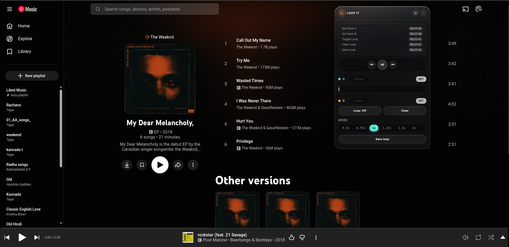
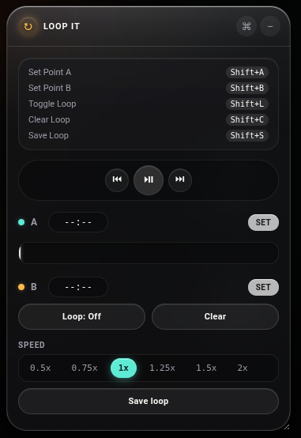

# Loop It — A-B Repeat for YouTube & YouTube Music (v2)

 

A floating panel that loops any section of a YouTube video or YouTube Music
track, shows your loop markers right on the real progress bar, lets you
slow playback down, and remembers your loop per track.

## Install (Chrome, Edge, Brave — any Chromium browser)

1. **Download the extension**: Go to the [Releases page](https://github.com/Tejas-pr/browser-extensions/releases/latest) and download `loopit-extension.zip`.
2. Unzip this folder somewhere permanent (don't delete it after installing).
3. Open `chrome://extensions` (or `edge://extensions`).
4. Turn on **Developer mode** (top-right toggle).
5. Click **Load unpacked** and select the `loopit-extension` folder.
6. Go to youtube.com or music.youtube.com and play something.

No API keys, no account, no data collection — everything stays in your
browser's local storage.

## Features

- **Media Controls** — Play/Pause, Next Track, and Previous Track buttons right in the panel.
- **Manual Time Entry** — Type exact timestamps (like `1:20`) into the A and B fields, or click "SET" to use the current time.
- **Draggable Timeline** — Drag the timeline in the panel to visually set your loop points.
- **Markers on the real scrubber** — A/B points show directly on YouTube's own progress bar.
- **Playback speed** — Slow a passage down to learn it, then bring it back to full speed.
- **Saved loops** — Hit **Save loop** to remember the loop for that exact video/track.
- **Beautiful Glassmorphic UI** — A stunning translucent UI that looks great in modern browsers.
- **Auto-reset on Track Change** — Loop points cleanly reset when you navigate to a new track.

## How to use it

- **Media Controls** — Use the new Prev/Play/Next buttons to control playback without hunting for YouTube's buttons.
- **Set A / Set B** — Click the inputs to type a time, click "SET", or drag the timeline.
- **Loop: On/Off** — Toggles the repeat.
- **Speed chips** — Change `video.playbackRate` instantly.
- **Save loop / Forget** — Persist or remove the loop for this track.
- **Shortcuts Panel** — Click the `⌘` icon to view all keyboard shortcuts.
- Drag the header to move the panel; **−** minimizes it.

Keyboard shortcuts (ignored while typing in a text field):

| Shortcut | Action |
|---|---|
| `Shift+A` | Set point A |
| `Shift+B` | Set point B |
| `Shift+L` | Toggle loop |
| `Shift+C` | Clear the loop |
| `Shift+S` | Save the current loop |

## Notes / limitations

- Works on `youtube.com` (regular videos) and `music.youtube.com`.
- Saved loops are keyed by the video ID in the URL (`?v=...`), stored in
  `localStorage` — they're per-browser, not synced across devices.
- If YouTube swaps the `<video>` element (e.g. after an ad), loop points
  reset for that playback — expected, since it's technically a new video
  instance.
- The on-scrubber markers are a visual overlay positioned on top of
  YouTube's real progress bar, not injected into it — this is deliberately
  more robust against YouTube changing their internal markup.

## Publishing this yourself

- **Chrome Web Store**: register at the [Developer Dashboard](https://chrome.google.com/webstore/devconsole)
  (one-time $5 fee), set your public "Publisher name" in account settings,
  zip this folder, and upload it as a new item. Icons are already included.
- **Firefox**: works with minor manifest tweaks (Firefox supports MV3
  content scripts the same way); publish for free via
  [addons.mozilla.org](https://addons.mozilla.org).
